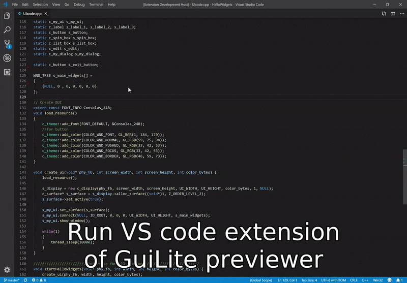

# GuiLite Previewer - WYSIWYG extension for GuiLite 
- [GuiLite](https://github.com/idea4good/GuiLite) is the smalles/simplest/stablest GUI library for all platforms, it has only 5,000 line C++ code.
- GuiLite Previewer is a Visual Studio Code extension, could extract GUI information from C++ code and preview GUI at preview page(What you see is what you get)
- No need for drag-and-drop widgets, everything (e.g. code/design/build/debug) could be done by coding
- No need for special GUI editor(e.g. Android Studio, Qt designer)
- No need for Extensible Markup Language(e.g. xml, xaml)

## Demo

## How to build GuiLite Previewer?
1. Download npm, and install
2. `cd GuiLitePreviwer`
3. `npm install` 
4. `code .` to open the project(VS Code version should be 1.25+)
- `F5` to start debugging

## How to use GuiLite Previewer?
1. Open your source code(e.g. test.cpp) with VS Code
2. `ctrl + shift + p`, and input `GuiLite: preview layout`
3. You will see your GUI layout in preview page
 
